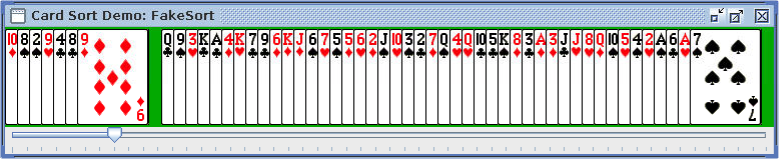

# Assignment 7: Card Sorting

In this assignment, we'll combine what we know about `LinkedLists` with our recent exploration of searching and sorting algorithms to implement card-processing algorithms over linked lists. This week you will implement several algorithms on `LinkedLists` to complement our exploration of how to implement them with `Arrays` in lecture.


For full credit, you will implement the following:

 - Linear Search
 - [Insertion Sort](https://en.wikipedia.org/wiki/Insertion_sort)
 - [Selection Sort](https://en.wikipedia.org/wiki/Selection_sort)
 - EITHER [Merge Sort](https://en.wikipedia.org/wiki/Merge_sort) OR [Quicksort](https://en.wikipedia.org/wiki/Quicksort)

Note that the Wikipedia articles linked above focus on the *array* versions of the algorithms, whereas we will be implementing them using a linked list.

Additionally, you have probably noticed that sorting algorithms vary in their efficiency. In the final part of this assignment, you will test your implementations on lists of varying lengths to see how the sorting time changes. You will be asked to reflect on how your results compare to the theoretical computational complexity of different algorithms.

---
### 🚧 Heads up! 🚧
We will be using the Java [`LinkedList` implementation](https://docs.oracle.com/javase/7/docs/api/java/util/LinkedList.html) rather than your custom SLL from A3. That means you do **not** have direct access to the internal nodes the way you did in your own list class. Instead, the intended way to traverse the list is with a `for-each` loop or a `ListIterator`.

Java's `LinkedList` also includes some methods with array-like behavior, [such as `get(int index)`](https://docs.oracle.com/javase/7/docs/api/java/util/LinkedList.html#get(int)), but these are usually the wrong tool here because they require walking across the list behind the scenes. For full credit, be sure to **avoid methods that involve repeated traversal across the list**, including index-based methods and also ones that require searching for a particular element. These undermine the efficiency of a list-based approach. Here, iterators will be very useful!

---
## File List
There are a lot of classes included with this assignment, but you will not need to modify all of them.

You will not need to change these classes:
- `Card` describes a single card (e.g., Four of Hearts). It is analagous to an individual `Node` within a linked list
- `CardPile` implements a collection of cards. This class is an implementation of a `LinkedList` itself, providing a collection of `Nodes`
- `SortRecorder` is a tool to allow you to track each step of your algorithm while it is running
- `FakeSort` is a fake sorting algorithm that doesn't do much, but it shows you the general structure of how to implement an algorithm that processes `Cards` within a `CardPile`
- `SortRecorder` is a “listener” class that will keep track of changes in your `CardPile` as your sorting algorithm progresses. This will allow you to visualize how things change as you sort the deck. You can see how to use it in `FakeSort`

The other classes (`LinearSearch`, `InsertionSort`, `SelectionSort`, `MergeSort` and `Quicksort`) are where you will actually write your code.

## Running a Demo with FakeSort

All of the necessary code to drive the graphical portion of this assignment is provided in `Card.java` and `CardPile.java`. Though you do not need to modify either of these files, feel free to take a look inside to get a sense for how they work.

For our demo, we'll focus on `FakeSort.java`, which contains a visual demonstration of the progression of an ineffective sorting algorithm:



This program doesn't do any actual sorting, it just moves the cards from the "unsorted" area to the "sorted" area one by one, allowing you to watch the algorithm as it progresses step by step.

Before you write any code, run `FakeSort` and move the slider to see how it works. Note: The visualization often takes a beat -- like maybe 30 seconds -- to load.

## Program Specifications

In order to keep things organized, you will write separate classes for each algorithm you implement in files called `LinearSearch.java`, `InsertionSort.java`, `SelectionSort.java`, and either `MergeSort.java` or `Quicksort.java`. Stubs for these classes have already been provided.

You should add a main method to each algorithm class following the outline that you can see in `FakeSort.java`. In each main class, you will:
1. Initialize a deck of cards, shuffle it, and then run the expected algorithm.
2. Create a record of what the program does using the `SortRecorder` class, as shown in the demo. You should create:
   1. **one snapshot per comparison** in linear search
   2. **one snapshot per outer loop iteration** in insertion sort and selection sort
   3. **one snapshot per merge operation** in merge sort, if that is your advanced sort
   4. For quicksort, if that is your advanced sort, create a view of each list both before and after moving the cards to either side of the pivot, and then after the recursive call has returned.

Please note that you can use the `compareTo` method of the `Card` class to compare two cards based on rank-suit. Demo code showing how to use `compareTo` is provided in `FakeSort` (but has been commented out)

When you structure your code, avoid writing two nearly identical versions of the same algorithm. A good pattern is to keep one real sorting implementation and make the `SortRecorder` optional:

```java
public static CardPile sort(CardPile unsorted) {
  return sort(unsorted, null);
}

public static CardPile sort(CardPile unsorted, SortRecorder record) {
  // real sorting logic goes here
}
```

With this setup, your visual demo can call `sort(cards, recorder)` while your timing runs can call `sort(cards)` without recording. This keeps your algorithmic code in one place.

## Phase 1: Searching a LinkedList

Linear search is the simplest search strategy: start at the beginning of the list and inspect one element at a time until you either find the target or run out of list.

This algorithm will look like:

- Until the pile is empty or the target is found:
  - Compare the next card to the target card.
  - If they match, stop and report success.
  - Otherwise continue to the next card.

Your `LinearSearch.search(...)` method should return `true` if the target card is present in the pile, and `false` if it is not.

Your programs will use the `CardPile` class (which extends `LinkedList<Card>`) to store each collection of cards that you want to sort. This strategy of using Java’s built-in `LinkedList` collection provides some useful functionality, including being able to shuffle the cards by calling `Collections.shuffle(...)` on a `CardPile` (as we do in `FakeSort.java`). It also means that you should think in terms of iterators and front/back operations rather than raw node manipulation. You should record these operations using the `SortRecorder` class, as shown in the stub for each algorithm and in `FakeSort.java`.

As we've seen in class, processing a list differs somewhat from processing an array: **insertion** and **deletion** of elements is easy on a list, but hard in an array (because a full array includes no room for insertion, and deletion leaves an empty hole in an otherwise full array). Because of this, the algorithms we developed for sorting on arrays involved lots of _swapping_, because the only way to make room for an element was to move another one out of the way.

With lists, instead of _swapping_ elements to reorder them, the natural approach is to work with **two lists**, removing elements from the `unsorted` list and inserting them into the `sorted` list without disturbing the order of any other items. Note that the unsorted list will begin full and shrink as elements are removed from it, while the sorted list will begin empty and grow until it contains all the elements of the original unsorted list. As mentioned above, if you find yourself swapping values using the `set()` method, you're probably using the lists too much like arrays and failing to take advantage of their strengths.

For reference, below are summaries of the sorting algorithms referenced in this assignment as they are implemented on lists:

## Phase 2: Sorting a LinkedList

### Selection Sort

The selection sort algorithm looks like: 

 - Until `unsorted` is empty:
   - Scan `unsorted` for the smallest remaining element.
   - Remove that element from `unsorted` and add it to the tail of `sorted`.

_One good way to do this:_ Use iterators to scan through the list while keeping track of the smallest card seen so far.

_Another way:_ Avoid using an index by actually pulling out the smallest element seen so far, and then swapping it back in if and when you encounter a smaller one.

Because Java's `LinkedList` does not expose its nodes directly, iterator-based solutions are usually the cleanest approach here.

### Insertion Sort

The insertion sort algorithm looks as follows:

- Until `unsorted` is empty:
  - Remove the first element from `unsorted` and find the point where it should go in `sorted` (the point where all previous elements are smaller than the removed element and all following elements are greater than or equal to it).
  - Insert the removed element into `sorted` at this point.
 
## Phase 3: More Advanced Algorithms

Implement one of the two algorithms below (your choice!)

### Merge Sort

The algorithm:

- Begin by placing each element of `unsorted` into its own new singleton `CardPile` and add all those piles to a queue.
- While more than one list remains on the queue:
  - Remove the first two lists from the queue and merge them, preserving their sorted order.
  - Put the result back at the end of the queue.

_To merge two sorted lists into a single sorted list:_
  - Look at the first element in each list.
  - Take the smaller of the two off the front of its old list and put it at the end of a new (merged) list.
  - Repeat this until both one of the old lists is empty, at which point you can append the remainder of the other original list to the new list.
  - If the original lists were sorted, and you always take the smallest element available, then the resulting list will also be sorted. (You might want to convince yourself of this fact before continuing.)

_Note: the **key operation** here is the merging of two sorted lists. Probably you will want to develop a method for this and test it thoroughly before tackling the full program._

### Quicksort

Quicksort is a recursive algorithm: the base case is a list with 0 or 1 elements, which is already sorted and can simply be returned.

For the recursive step, do the following:

 * Take the first element as the pivot.
 * Pull the remaining elements off the list one at a time and append them to either of two new sublists: one for elements **less than the pivot** and one for elements **greater than or equal to the pivot**.
 * Recursively sort the two sublists, then glue the results back together with the pivot in the middle, and return that as the result.

## Phase 4: Experimentation

Now that you have working (and thoroughly debugged!) implementations of your algorithms, we are ready do some empirical investigation of differences in their runtimes. For this part, you will use the provided `AlgorithmTimingRunner.java` harness, which runs your search/sorting methods without the (slow) graphics.

The timing harness calls your existing sorting code. This is one reason why it is helpful to keep your sorting logic separate from the graphics/recording code.

(_Note: The timing harness does not record graphics. Eliminating the recording is necessary because recording takes up both time and memory, which gets in the way of measuring the time required for the sorting itself. Make sure you disable any debugging printouts as well._)

## Using the Unix `time` command

You can time a program on unix-based systems by preceding the call to run it with `time`, for example:

```time java AlgorithmTimingRunner insertion 10000```

(Note: if you are using PowerShell, you will need to look up `Measure-Command` instead.)

If this is your first time doing timing from the command line, here is a reasonable workflow:

1. Open a terminal in your assignment folder or in VSCode/IntelliJ.
2. Compile your code.
3. Run the timing harness once with a small input first (e.g., 52 cards) to make sure it works.
4. Then run larger inputs and record the timing results in a table.

For example:

```sh
javac *.java
time java AlgorithmTimingRunner fake 20
time java AlgorithmTimingRunner linear 10000
time java AlgorithmTimingRunner insertion 10000
time java AlgorithmTimingRunner selection 10000
time java AlgorithmTimingRunner merge 10000
```

If you chose quicksort instead of merge sort, replace `merge` with `quick`.

The `fake` option is included only as a quick demonstration of how to use the timing harness before your real algorithm code is finished. Do not use `fake` as one of the algorithms in your actual timing comparison.

The `time` command will print out a result that looks something like this:

```text
real    0m0.812s
user    0m0.781s
sys     0m0.021s
```

These values mean:

- `real`: the total wall-clock time that passed while the program was running
- `user`: the time the CPU spent running your Java code
- `sys`: the time spent in operating-system calls

For this assignment, `user` is usually the most useful number to compare, because it is closest to the time spent doing the actual computation. If your system reports times differently, use the number that seems closest to the program's CPU time. If you are unsure, you may use `real` instead, but be consistent across all of your measurements.

It is also a good idea to run the same timing more than once and use a typical value rather than trusting a single run, since background activity on your computer can affect the result.

Please benchmark `LinearSearch` as a simple `O(n)` baseline, and also run at least two of your implemented sorting algorithms on inputs that double progressively in size: 10000 cards, 20000 cards, 40000 cards, etc. Continue until you see a clear difference in speed, or until one method is unable to finish in a reasonable time (say a few minutes). 

Do your experiments match your expectations? When you're done, write up a short summary of your findings to include in your `readme.md`.

## Kudos

There are lots of potential extensions for this assignment. Some ideas:
1. Implement another algorithm (both quicksort and merge sort)
2. Benchmark more algorithms
3. Benchmark your implementations on various kinds of inputs: random order, already sorted, sorted in reverse. How does this change the runtime for different algorithms?